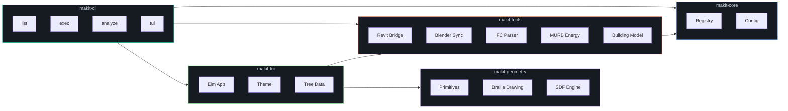

```
+======================================================================+
|                                                                      |
|     * makit                                                          |
|     ----------------------------------------                         |
|     A multi-tool CLI & TUI for AEC workflows                         |
|                                                                      |
|     > revit    > blender    > ifc    > murb    > rhino               |
|                                                                      |
|     +-------------+  +----------------------------------+            |
|     | # Explorer   |  | @ Detail                         |           |
|     |..............|  |..................................|           |
|     | > Revit      |  |  ___                             |           |
|     |   > Walls    |  | |###| ##                         |           |
|     |   > Floors   |  | |###| ## ##                      |           |
|     | > IFC        |  | |###| ## ## ##                   |           |
|     | > MURB       |  | |###| ## ## ## ## ##             |           |
|     | > Blender    |  | =============================== |            |
|     +-------------+  |  J  F  M  A  M  J  J  A  S  O   |             |
|                       +----------------------------------+           |
|     +----------------------------------------------------+           |
|     | Ready -- use up/dn to navigate, -> to expand       |           |
|     +----------------------------------------------------+           |
|                                                                      |
|     Rust . rsille . MIT                                              |
|                                                                      |
+======================================================================+
```

---

Built in Rust with [rsille](https://github.com/nidhoggfgg/rsille) for braille-rendered terminal graphics. Makit bridges the gap between BIM authoring tools and programmatic analysis — connect to live applications, extract building geometry, run cross-platform analytics, simulate energy performance, and visualize results, all without leaving the terminal.

## Features

| Feature | Description |
|---------|-------------|
| **Interactive TUI** | Tree explorer with real-time braille canvas preview and responsive layout |
| **Live Revit Bridge** | Extract walls, floors, rooms via pyRevit HTTP; run orientation & WWR analysis |
| **IFC Analysis** | Standalone wall orientation and Window-to-Wall Ratio analysis (no Revit required) |
| **Blender Sync** | Receive live geometry from Blender over HTTP for TUI visualization |
| **MURB Energy** | Monthly heat balance simulation — TEDI / TEUI / GHGI analysis via Python bridge |
| **Braille Canvas** | Floor plans, elevations, bar charts, and data sheets in braille characters |
| **3D Logo** | Animated rotating hexagonal wireframe on the TUI home screen |
| **Generic JSON Format** | Extract from any source into one schema, run the same analysis everywhere |

## Quick Start

### Build from Source

```bash
git clone https://github.com/winterweken/makit.git
cd makit
cargo build --release
```

### Launch the TUI

```bash
cargo run -p makit -- tui
# or just:
cargo run -p makit
```

| Key | Action |
|-----|--------|
| `↑ ↓` | Navigate the tree |
| `→ ←` | Expand / collapse |
| `Enter` | Open / execute |
| `Tab` | Switch pane focus |
| `?` | Toggle help overlay |
| `Esc` | Quit |

### CLI Commands

```bash
# List all registered tools, sources, and actions
makit list

# Execute a specific action
makit exec revit analysis revit-wall-orientations

# Analyze an IFC file
makit analyze examples/IFC/Building-Architecture.ifc

# Show help
makit --help
```

### Canvas Demo

```bash
cargo run -p makit --example canvas_demo
```

Renders braille-character shapes, a floor plan with interior walls, and filled rectangles — straight in the terminal.

---

## Architecture



### Workspace Layout

```
makit/
├── crates/
│   ├── makit-cli/           # Binary — clap CLI (list, exec, analyze, tui, status, init)
│   ├── makit-core/          # Registry singleton, config (figment/YAML), model types
│   ├── makit-geometry/      # Point, Line, Rectangle, Room, Floor + braille drawing + SDF
│   ├── makit-tools/         # Tool implementations (revit, blender, ifc, murb)
│   └── makit-tui/           # rsille-native TUI (tree explorer, canvas viz, theme)
├── pyrevit-extension/       # Python pyRevit extension (runs inside Revit)
├── scripts/
│   ├── blender/             # Python Blender addon
│   └── murb_runner.py       # Python bridge for MURB energy tool
├── examples/IFC/            # Sample IFC files and analysis scripts
└── docs/                    # Architecture documentation
```

### Tool Registry

Tools register **sources** (geometry input drivers) and **actions** (operations) at startup:

<table>
<tr><th>Source</th><th>Description</th></tr>
<tr><td><code>revit</code></td><td>Autodesk Revit via pyRevit HTTP bridge (port 48884)</td></tr>
<tr><td><code>blender</code></td><td>Blender live geometry sync (axum server)</td></tr>
<tr><td><code>ifc</code></td><td>IFC file loader + IfcOpenShell extraction</td></tr>
<tr><td><code>murb</code></td><td>MURB energy modelling (Python subprocess)</td></tr>
<tr><td><code>rhino</code></td><td>Rhino 3D / Grasshopper integration</td></tr>
</table>

<table>
<tr><th>Action</th><th>Category</th><th>Description</th></tr>
<tr><td><code>revit-extract-walls</code></td><td>extraction</td><td>Extract wall elements from Revit</td></tr>
<tr><td><code>revit-wall-orientations</code></td><td>analysis</td><td>Wall orientation + WWR analysis</td></tr>
<tr><td><code>murb-simulate</code></td><td>analysis</td><td>Monthly energy simulation</td></tr>
<tr><td><code>murb-report</code></td><td>reporting</td><td>TEDI / TEUI / GHGI report</td></tr>
<tr><td><code>architect-render-demo</code></td><td>rendering</td><td>Architectural demo rendering</td></tr>
<tr><td colspan="3"><em>12 actions total — run <code>makit list</code> to see all</em></td></tr>
</table>

### Key Dependencies

| Crate | Purpose |
|-------|---------|
| [rsille](https://github.com/nidhoggfgg/rsille) v3 | Braille canvas, TUI widgets, terminal rendering |
| [clap](https://docs.rs/clap) 4 | CLI argument parsing |
| [figment](https://docs.rs/figment) | Config management (YAML + env) |
| [reqwest](https://docs.rs/reqwest) | HTTP client for pyRevit bridge |
| [axum](https://docs.rs/axum) | HTTP server for Blender sync |
| [tokio](https://docs.rs/tokio) | Async runtime |

---

## Development

```bash
# Build
cargo build

# Run all 50 tests (5 registry, 18 geometry, 27 tools)
cargo test

# Run the CLI
cargo run -p makit -- --help

# Run the TUI
cargo run -p makit -- tui

# Run the canvas demo
cargo run -p makit --example canvas_demo

# Format & lint
cargo fmt
cargo clippy
```

### TUI Architecture

The TUI follows the **Elm architecture** pattern:

```
State → view(state) → Widget tree → terminal render
  ↑                                       |
  └──── update(state, msg) ← user input ──┘
```

- **`State`** — app data (active node, logo angle, analysis results, terminal width)
- **`Msg`** — discrete events (`TreeFocused`, `TreeOpened`, `Tick`, `IfcFileSelected`)
- **`update`** — pure reducer mapping state × message → new state
- **`view`** — pure function mapping state → widget tree

---

## License

MIT
